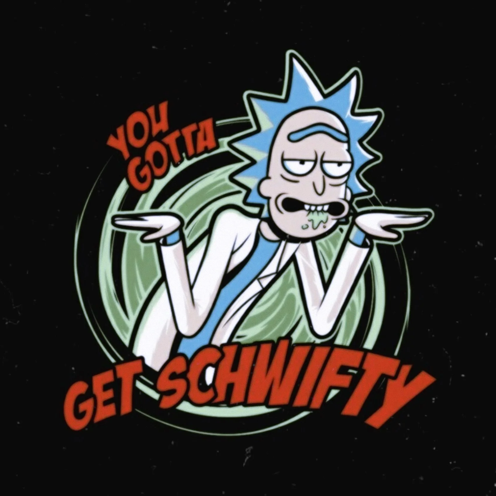
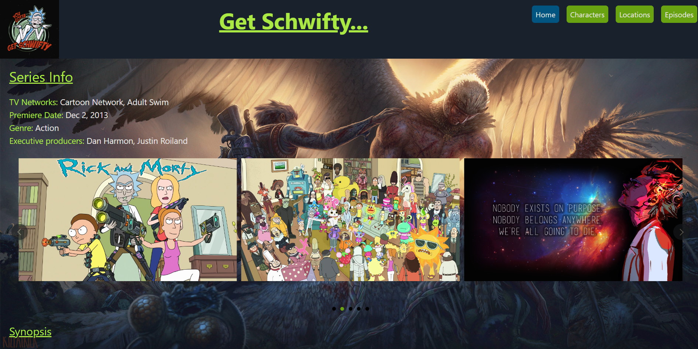
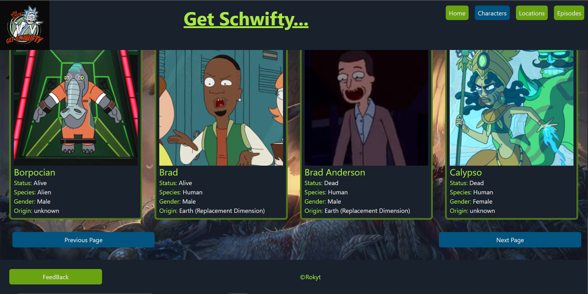
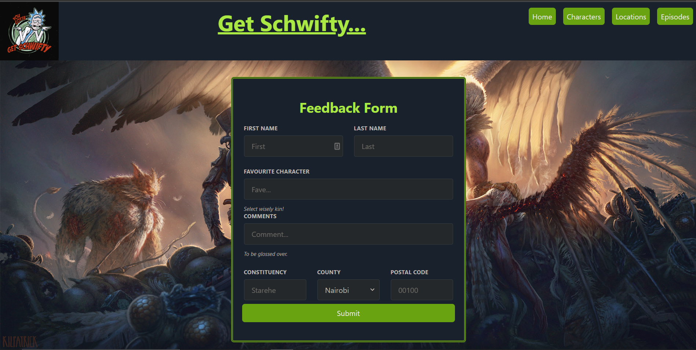
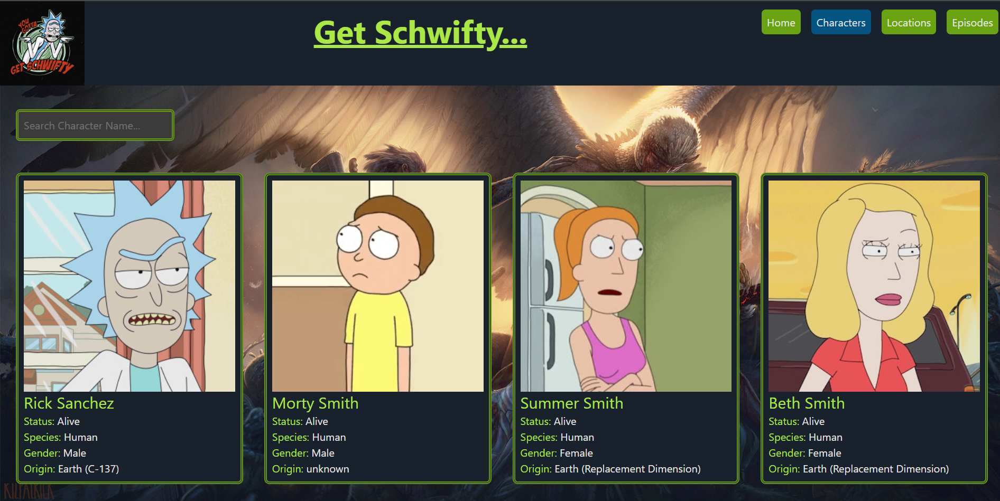

[](logo.png)

# SCHWIFTY

## By: ROY OKITE

## Project Description

The project is a react application that is an information hub focusing on the Rick and Morty universe where a user can explore different infromation regarding the show's characters, locations and episode details as well. It also has a feedback component where a user can choose to reach out to me and provide some basic information such as their name and favourite character. The landing page displays a carousel of images related to the show, some basic show information such as the executive producers and network as well as the synopsis for those unfamiliar with show. (X to doubt)

The application was developed to meet the set project requirements:

- It is a single page application.
- It utilises 11 components for code organization and resusability. (5 minimum requirement)
- The application employs the use of client-side routing for page to page navigation.
- A GET and POST request, GET is incorporated to use a publicly available API [Rick and Morty API](https://rickandmortyapi.com/api), while POST was used in the feedback component after creating a JSON file.
  <br />
  <br />

  

## Deliverables

The app utilizes a single HTML file, Tailwind CSS for styling and Javascript/JSX for interactivity.

A user is able to:

- View character, location and episode information with the option to view more via the next button which renders an additional items each time it is pressed.
  <br /> <br />
  
  <br /> <br />
- Use the feedback form to reach out by inputing some details such as the first name and favourite character.
  <br /> <br />
  
  <br /> <br />
- Read about the show's details on the landing page and navigate to the other available pages using provided links.
  <br /> <br />
- Search for character using their name.
  <br /> <br />
  
  <br /> <br />

## Setup Instructions

The project has been deployed and hosted on netlify [netlify](https://app.netlify.com) which is a remote-first cloud computing company that offers a development platform that includes build, deploy, and serverless backend services for web applications and dynamic websites.

Besides the [Rick and Morty API](https://rickandmortyapi.com/api) the app also utilized a local JSON file that handles the data submitted from the feedback form. Heroku would be ideal as the host for this data.

### Closing

This react app took a few days to planning, design, develop and deploy. More interactivity and modifications will be made overtime even after submission to polish the style, data and components available on the app.

Sample code to render the characters on the page:

```
function Characters() {
    const [characters, setCharacters] = useState([])
    const [pageNo, setPageNo] = useState(1)
    const [search, setSearch] = useState('')

    useEffect(() => {
        fetch(`https://rickandmortyapi.com/api/character?page=${pageNo}`)
            .then(response => response.json())
            .then(data => setCharacters(data.results))
    }, [pageNo])

    const searchItems = characters.filter(ch => ch.name.toLowerCase().includes(search))
    const renderCharacters = searchItems.map(char =>
        <EachCharacter
            key={char.id}
            name={char.name}
            status={char.status}
            species={char.species}
            gender={char.gender}
            image={char.image}
            origin={char.origin.name}
        />)

    return (
        <section>
            <input
                type="text"
                name="search-bar"
                value={search}
                onChange={(e) => setSearch(e.target.value)}
                placeholder="Search Character Name..."
                className="border-double border-4 border-lime-400 m-6 rounded-md w-60 p-2"
            /> <br />
            <article className="grid gap-8 grid-cols-4 m-6">
                {renderCharacters}
            </article>
            <article className="grid grid-cols-4 gap-0 justify-center m-6">
                <button
                    onClick={() => setPageNo((pageNo) => pageNo - 1)}
                    className="bg-sky-700 m-2 p-2 rounded-md hover:bg-lime-500 col-start-1 disabled:opacity-0"
                    style={{width: "100%"}}
                    disabled={pageNo === 1 ? true : false }
                > Previous Page

                </button>
                <button
                    onClick={() => setPageNo((pageNo) => pageNo + 1)}
                    className="bg-sky-700 m-2 p-2 rounded-md hover:bg-lime-500 col-end-5 disabled:opacity-0"
                    style={{width: "100%"}}
                    disabled={pageNo === 42 ? true : false }
                >Next Page
                </button>
            </article>
        </section>
    )
}
```

### Closing

All the information and resources used have been publicly sourced from the API and show's website for use and a special
thanks goes to the shows creators for developing such a unique and entertaining universe whose animated show inspired the creation of this project as part of my learning process.

All the code and resources utilized have been developed by myself.

## This project aims to fulfill requirements for the Moringa School phase 2 project.
